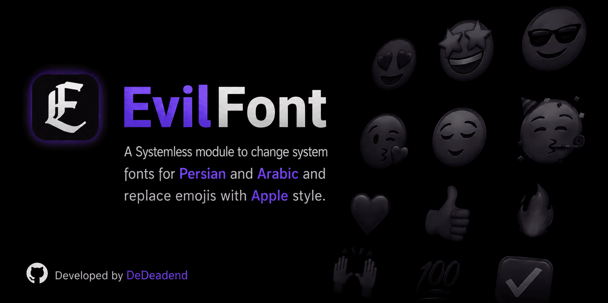
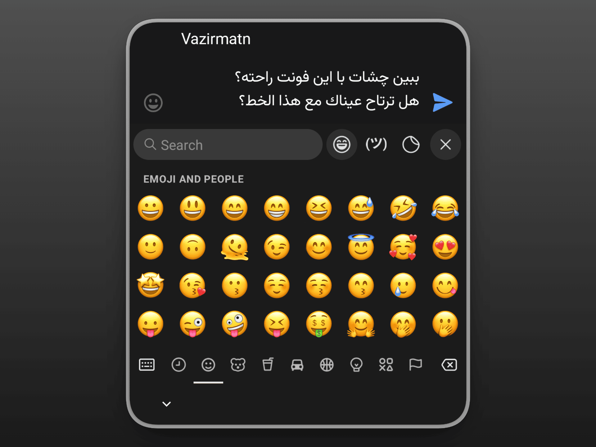

  

  
  
  
  

# 🪶 EvilFont

Transform your Android UI with **EvilFont**. This systemless module lets you **interactively choose** from a beautiful collection of **Arabic/Persian typefaces** and install high-definition **Apple Emojis**. Want just the font? Just the emoji? Or both? The choice is entirely yours. Designed for safety and flexibility, EvilFont delivers a premium experience without ever modifying your `/system` partition.

## ✨ Features

- ⚙️ **Interactive Installer**: Use your device's **volume keys** to navigate and select your desired font and emoji style during the installation process.
- 🧩 **Modular Selection**: You're in full control. Choose to install **only a font**, **only the emoji pack**, or **combine both** for a complete UI makeover.
- 🎨 **Curated Font Library**: Choose from over a dozen beautiful and open-source Arabic/Persian fonts.
- 🤩 **Multiple Emoji Versions**: Now supporting **iOS 18.4** and **macOS 26** emoji styles. Select the one that suits you best.
- 🛡️ **Systemless**: All customizations are applied without touching your `/system` partition, keeping SafetyNet/Play Integrity happy.
- ⚡ **Lightweight**: Designed to have no noticeable impact on system performance.
- 🫧 **Compatibility**: Works on most AOSP and custom-skinned Android versions.

## ⚙️ How It Works

EvilFont is installed as a systemless root module. During installation, the interactive installer lets you choose which resources should be applied using the device's volume keys.

The available resources are:

- **Arabic & Persian Fonts**: A collection of open-source typefaces with different styles.
- **Apple Emoji**: Emoji packs based on **iOS 18.4** and **macOS 26**.

You can install a font, an emoji pack, or both at the same time. The selected resources are applied through the module environment without modifying the original `/system` partition.

To change the selection later, simply reinstall the module and choose the desired resources again.

## 📸 Screenshot

- For a complete preview of all fonts and styles, check out the **[Screenshots Folder](screenshots/)**.

| Font & Emoji |
|:---:|
|  |

## 📥 Installation

> [!CAUTION]
> - **Requirements**: Magisk, KernelSU or APatch installed.
> - **Disclaimer**: This module is thoroughly tested and safe. However install at your own risk.

1. Download the latest `EvilFont-v2.x.zip` from the [Releases Page](https://github.com/dedeadend/EvilFont/releases/latest).
2. Open your **Root Manager** app.
3. Go to the **Modules** tab.
4. Install the downloaded zip. The interactive installer will launch.
5. **Use the volume keys** to make your selections for the font, emoji version, or both when prompted.
6. Reboot and Enjoy 💚

- To change your font or emoji style later, simply **re-install the module** and make new selections.

## 🌐 Official DeDeadend Links

EvilFont is one of the **DeDeadend** projects:

  
  
  
  

## ❤️ Donation

If you find this project helpful, please give it a ⭐

You can also support the development through a donation:

  

## 🙌 Credits

- **Emoji Assets**: This project uses emoji font files from [apple-emoji-linux](https://github.com/samuelngs/apple-emoji-linux). These assets are used under the terms of the **Apache-2.0 License**.
- **Typography**: Special thanks to all the typeface designers for their beautiful open-source fonts.

## ⚖️ License

Distributed under the **Apache-2.0 License**. See [LICENSE](LICENSE) for more information.

---

  Developed with 💚 by <a href="https://github.com/dedeadend">DeDeadend</a>

