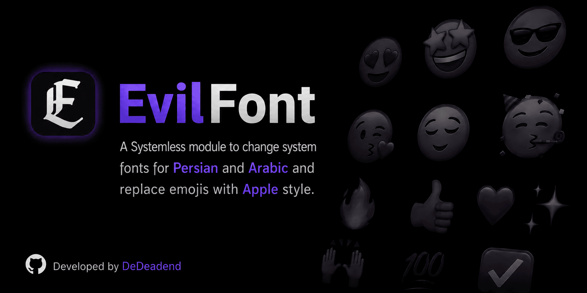
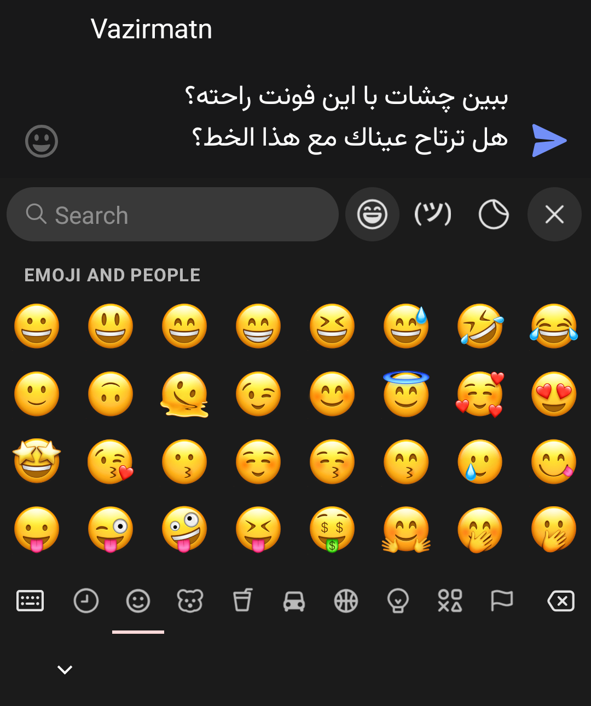

  

  
  
  <!--  -->
  
  

> [!IMPORTANT]
> **EvilFont 2.0 is here! 🫧**
> - A complete overhaul with an interactive installer. Mix and match exactly what you need: choose any font, any emoji style, or grab both. It's all up to you!

# 🪶 EvilFont

Transform your Android UI with **EvilFont**. This systemless module lets you **interactively choose** from a beautiful collection of **Arabic/Persian typefaces** and seamlessly integrates high-definition **Apple Emojis** (with multiple versions available). Want just the font? Just the emoji? Or both? The choice is entirely yours. Designed for safety and flexibility, EvilFont delivers a premium typography experience without ever modifying your `/system` partition.

## ✨ Features

- ⚙️ **Interactive Installer**: Use your device's **volume keys** to navigate and select your desired font and emoji style during the installation process.
- 🧩 **Modular Selection**: You're in full control. Choose to install **only a font**, **only the emoji pack**, or **combine both** for a complete UI makeover.
- 🎨 **Curated Font Library**: Choose from over a dozen beautiful and open-source Arabic/Persian fonts.
- 🤩 **Multiple Emoji Versions**: Now supporting **iOS 18.4** and **macOS 26** emoji styles. Select the one that suits you best.
- 🛡️ **Systemless**: All customizations are applied without touching your `/system` partition, keeping SafetyNet/Play Integrity happy.
- ⚡ **Lightweight**: Optimized for zero impact on system performance.
- 🫧 **Compatibility**: Works on most AOSP and custom-skinned Android versions.

## 📸 Screenshot

- For a complete preview of all fonts and styles, check out the **[screenshots folder](screenshots/)**.

| Font & Emoji |
|:---:|
|  |

## 📥 Installation

> [!CAUTION]
> - **Requirements**: Magisk, KernelSU or APatch installed.
> - **Disclaimer**: This module is thoroughly tested and safe. However install at your own risk.

1. Download the latest `EvilFont-v2.x.zip` from the [Releases Page](https://github.com/dedeadend/EvilFont/releases/latest).
2. Open your **Root Manager** app.
3. Go to the **Modules** tab.
4. Install the downloaded zip. The interactive installer will launch.
5. **Use the volume keys** to make your selections for the font, emoji version, or both when prompted.
6. Reboot and Enjoy 💚

- To change your font or emoji style later, simply **re-install the module** and make new selections.

## ♠️ Support

Have questions or need help? Feel free to reach out:

  
  <!--  -->

## ❤️ Donation

If you find this project helpful, please give it a ⭐

You can also support the development by buying me a coffee:

  

## 🙌 Credits

- **Emoji Assets**: This project uses emoji font files from [samuelngs/apple-emoji-linux](https://github.com/samuelngs/apple-emoji-linux). These assets are used under the terms of the **Apache-2.0 License**.
- **Typography**: Special thanks to all the typeface designers for their beautiful open-source fonts.

## ⚖️ License

Distributed under the **Apache-2.0 License**. See [LICENSE](LICENSE) for more information.

---

  Developed by <a href="https://github.com/dedeadend">DeDeadend</a>

